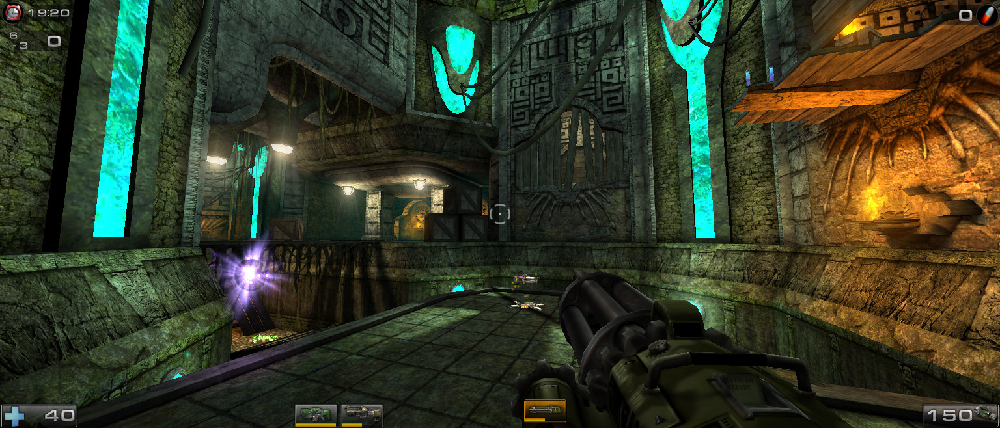

foxWSFix v2.1.2
===============
Improved widescreen support for Unreal Tournament 2004

Features
--------
* Aspect-correct "Hor+" FOV adjustment, including vehicle and weapon zoom values
* Aspect-correct rendering for first-person weapons
* Aspect-correct HUD support (mostly), based on Azarael's HUD Scaling Fix mutator
* Aspect-correct mouse sensitivity (scale off wider FOV instead of hard-coded 90)
* Entirely client-side - no mutators required

Install / Uninstall
-------------------
Extract the release archive to your UT2004 install directory.

Open System\User.ini and find the following line:

    InputClass=Class'Engine.PlayerInput'

Replace every instance of it with the following:

    ;InputClass=Class'Engine.PlayerInput'
    InputClass=Class'foxWSFix.foxPlayerInput'

**Note:** This line should appear *at least twice* - once under `[Engine.PlayerController]`, and
once under `[XGame.xPlayer]`. Be sure to change each one! (or add it if missing)

You're done! To uninstall, simply reverse your changes.

    ** v2.0 Upgrade Note **
    If upgrading from v2.0, you should revert v2.0's GUIController change.
    Open System\ut2004.ini and replace:
        GUIController=foxWSFix.foxUT2K4GUIController
    With the original:
        GUIController=GUI2K4.UT2K4GUIController

Usage
-----
Once installed, foxWSFix works automatically, with no configuration required.

Resolution can be adjusted via the game's built-in console command:

    SetRes <resolution>
     * <resolution> - new resolution to use, given as ##x##
        e.g. SetRes 1920x1080
             SetRes 3360x1440

In-game FOV can be adjusted via the menu as normal, or via a new console command:

    SetFOV <fov>
     * <fov> - new FOV to use, given as a 4:3 ratio FOV (90 @ 4:3 == 106.2602 @ 16:9, etc.)
        e.g. SetFOV 90

Other Notes
-----------
The FOV changes should be compatible with all mods, provided they don't use a custom PlayerInput class.

However, widescreen HUDs are provided for vanilla HUDs only.

foxWSFix stores its settings in System\User.ini as such:

    [foxWSFix.foxPlayerInput]
    bInputClassErrorCheck=True      ;Check User.ini InputClass settings for possible errors?
    Desired43FOV=90.000000          ;Desired 4:3 FOV per SetFOV command / menu setting
    bCorrectZoomFOV=True            ;Correct FOV values for weapon zoom?
    bCorrectMouseSensitivity=True   ;Correct MouseSensitivity for aspect ratio changes? (due to wider FOV)
    Desired43MouseSensitivity=2.200000 ;Desired 4:3 MouseSensitivity per SetSensitivity command / menu setting
    WideHUDMap=(HudClass=Class'UT2k4Assault.HUD_Assault',WideHUD="foxWSFix.foxWideHUD_Assault")
    WideHUDMap=(HudClass=Class'XInterface.HudCBombingRun',WideHUD="foxWSFix.foxWideHudCBombingRun")
    WideHUDMap=(HudClass=Class'XInterface.HudCCaptureTheFlag',WideHUD="foxWSFix.foxWideHudCCaptureTheFlag")
    WideHUDMap=(HudClass=Class'XInterface.HudCDeathmatch',WideHUD="foxWSFix.foxWideHudCDeathMatch")
    WideHUDMap=(HudClass=Class'XInterface.HudCDoubleDomination',WideHUD="foxWSFix.foxWideHudCDoubleDomination")
    WideHUDMap=(HudClass=Class'XInterface.HudCTeamDeathMatch',WideHUD="foxWSFix.foxWideHudCTeamDeathMatch")
    WideHUDMap=(HudClass=Class'SkaarjPack.HUDInvasion',WideHUD="foxWSFix.foxWideHUDInvasion")
    WideHUDMap=(HudClass=Class'BonusPack.HudLMS',WideHUD="foxWSFix.foxWideHudLMS")
    WideHUDMap=(HudClass=Class'BonusPack.HudMutant',WideHUD="foxWSFix.foxWideHudMutant")
    WideHUDMap=(HudClass=Class'Onslaught.ONSHUDOnslaught',WideHUD="foxWSFix.foxWideONSHUDOnslaught")

Additional WideHUDMap lines may be added or replaced for custom HUD replacements.

For example, to use HUDFix's UT2k3 widescreen HUDs, replace with the following:

    WideHUDMap=(HudClass=Class'UT2k4Assault.HUD_Assault',WideHUD="HUDFix.HUDW2K3Assault")
    WideHUDMap=(HudClass=Class'XInterface.HudCBombingRun',WideHUD="HUDFix.HudW2K3BombingRun")
    WideHUDMap=(HudClass=Class'XInterface.HudCCaptureTheFlag',WideHUD="HUDFix.HudW2K3CaptureTheFlag")
    WideHUDMap=(HudClass=Class'XInterface.HudCDeathMatch',WideHUD="HUDFix.HudW2K3DeathMatch")
    WideHUDMap=(HudClass=Class'XInterface.HudCDoubleDomination',WideHUD="HUDFix.HudW2K3DoubleDomination")
    WideHUDMap=(HudClass=Class'XInterface.HudCTeamDeathMatch',WideHUD="HUDFix.HudW2K3TeamDeathMatch")
    WideHUDMap=(HudClass=Class'SkaarjPack.HudInvasion',WideHUD="HUDFix.HudW2K3Invasion")
    WideHUDMap=(HudClass=Class'BonusPack.HudLMS',WideHUD="HUDFix.HudW2K3LMS")
    WideHUDMap=(HudClass=Class'BonusPack.HudMutant',WideHUD="HUDFix.HudW2K3Mutant")
    WideHUDMap=(HudClass=Class'Onslaught.ONSHUDOnslaught',WideHUD="HUDFix.ONSHUDW2K3Onslaught")

Known Issues
------------
* Some HUDs still have elements that don't quite scale correctly, particularly with ultra-wide (32:9 or greater) ratios.
    (e.g. Assault Rifle grenade counter, on-screen objectives, etc. - unfortunately these are drawn outside the HUD)

Source Code / Compile Steps
---------------------------
Source code for the project is included in the "Src" folder or online:
https://www.taraxis.com/foxwsfix-ut2k4

To compile, move the "foxWSFix" folder inside "Src" out into your root UT2004 install directory.

Then simply add the following to the [Editor.EditorEngine] section in System\ut2004.ini:

    EditPackages=foxWSFix

Finally, run "foxWSFix\Compile.bat" (or simply "UCC make") to compile the project.

Feedback
--------
If you have any questions or feedback, feel free to leave a comment on Steam:
https://steamcommunity.com/app/13230/discussions/0/611702631218438023/

And of course, thanks for trying the mod!
~fox

Changes
-------
v2.1.2 (2020-06-26):
* Fixed weapon rendering getting increasingly offset every level transition
  * (Note: Not applicable to foxWSFix99 for UT99, no fix needed there)

v2.1.1 (2020-06-24):
* Added in-game InputClass error handling to hopefully ease some install issues
* Updated installation instructions to reflect the above
* Clarified bCorrectMouseSensitivity (Unreal normally scales sensitivity against a hard-coded 90 FOV for zoom)

v2.1.0 (2020-02-27):
* Resolved AntiTCC issue with GUIController hook (see "v2.0 Upgrade Note" above)
  * (Note: All functionality is still in place, just handled in foxPlayerInput now)

v2.0.0 (2020-12-10):
* Configurable client-side HUD loading, no mutator required
* Fixed various issues with first-person weapon rendering
  * (Note: Omitted by accident from original v2.0 patch notes, oops)
* Integration / reimplementation of Azarael's HUD Scaling Fix HUDs, fixing a few minor bugs (such as Adrenaline meter not scaling in CTF)
* Automatic aspect ratio determination (SetRatio removed, no longer needed)
* FOV adjustment now applies to weapon zoom etc. and is driven by menu FOV setting (or SetFOV as before)
* Fixed issue where input settings weren't saved when adjusted in-game
* Mouse sensitivity now auto-adjusts to be consistent across aspect ratios

v1.1.1 (2015-10-07):
* Fixed optimization-related general protection fault

v1.1.0 (2015-10-07):
* Optimizations to avoid recalculating view FOV and weapon FOV every frame (oops!)
* Don't use FOV function as that calls SaveConfig every run, leading to performance issues (oops!)

v1.0.0 (2015-04-03):
* Initial release.
